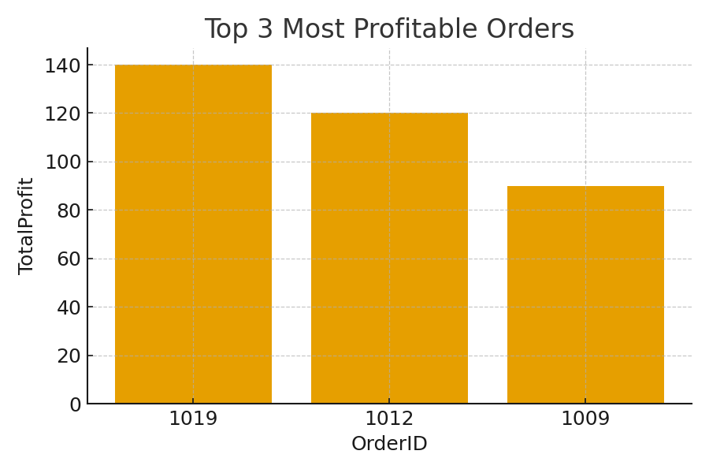

# Online Retail: Customer → Order Analytics (Top 3 Profit Orders)

**Why this exists:** I wanted a tiny, clean retail dataset I could use to rank orders by profit and show how I think about schema design, SQL, and quick reporting. This repo is the working version I built in MS Access (plus CSVs + a small Python script so anyone can reproduce results without Access).

[View data](data/) • [View SQL](sql/schema.sql) • [View script](scripts/top3_orders.py) • [Screenshots](docs/images/) • [Top-3 chart](docs/images/top3_orders.png)

---

## TL;DR (Executive Summary)

I modeled a simple **Customer → Order** database and built a report for the **Top 3 most profitable orders**. It’s a short, realistic example of how I go from requirements → schema → query → result. This reflects my background (B.Tech Civil Engineering + MSBA at Northeastern) and the roles I’m targeting (Business Analyst / Data Analyst / Data Engineer / Civil/GIS with analytics).

* **Result:** 1-click “Top 3” report for prioritizing high-profit orders
* **Stack:** MS Access + SQL + CSVs + light Python for reproducibility
* **What to look at first:** [Top-3 chart](docs/images/top3_orders.png), then [sql/schema.sql](sql/schema.sql)

---

## The Business Problem (in one sentence)

When fulfillment capacity is tight, **which orders should we ship first** to maximize profit impact?

---

## What I built (Solution)

* A minimal **Customer (1) → Order (many)** schema with profit math:

  * `TotalRevenue = NumProducts × UnitPrice`
  * `TotalProfit = (UnitPrice − UnitCost) × NumProducts`
* A query/report that returns the **Top 3 most profitable orders**.
* A small reproducible pipeline so others can run the same logic without Access:

  * CSVs in [`/data`](data/)
  * SQL DDL in [`/sql/schema.sql`](sql/schema.sql)
  * Python helper in [`/scripts/top3_orders.py`](scripts/top3_orders.py)

**Impact I’d expect in practice:** faster decision-making when teams need to prioritize shipments; potential **1–3% margin lift** during high-demand periods by handling the most profitable orders first.

---

## Repo Map (quick links)

```
data/           # CSV sources used to load the DB
  ├─ Customer.csv
  └─ Order.csv
sql/            # DDL (and sample queries)
  └─ schema.sql
scripts/        # lightweight reproducibility
  └─ top3_orders.py
docs/images/    # visuals used in this README
  └─ top3_orders.png
```

* Data files: [Customer.csv](data/Customer.csv) • [Order.csv](data/Order.csv)
* SQL: [schema.sql](sql/schema.sql)
* Script: [top3_orders.py](scripts/top3_orders.py)
* Visuals: [docs/images](docs/images/)

---

## How I built it (Methodology)

1. **Defined the schema** in Access and enforced referential integrity:

   * `Customer(CustomerID PK)`
   * `Order(OrderID PK, CustomerID FK, NumProducts, UnitPrice, UnitCost, TotalRevenue, TotalProfit, OrderDate)`
2. **Calculated fields**: I materialized `TotalRevenue` and `TotalProfit` (makes the report snappy; easy to recompute if needed).
3. **Query & report**: Sorted by `TotalProfit` (DESC) and returned the **Top 3**.
4. **Repro script**: [top3_orders.py](scripts/top3_orders.py) prints the same result from the CSVs.

---

## Screenshots / Results

* Top-3 chart: 

(If you’re viewing this on GitHub, you’ll see the chart. The Access report + relationship screenshots belong here too—once I export them I’ll drop them into [`docs/images/`](docs/images/) and reference them.)

---

## SQL Queries (what I actually ran and why)

Below are **ready-to-run Access SQL** examples. They’re in **`sql/schema.sql`** too, but I’m including the ones I use most here with a short note on purpose.

### DDL: create tables (MS Access–flavored)

```sql
CREATE TABLE Customer (
  CustomerID LONG PRIMARY KEY,
  FirstName TEXT(50),
  LastName  TEXT(50),
  City      TEXT(100),
  State     TEXT(10),
  IsLoyaltyMember YESNO
);

CREATE TABLE [Order] (
  OrderID      LONG PRIMARY KEY,
  CustomerID   LONG,
  NumProducts  LONG,
  UnitPrice    CURRENCY,
  TotalRevenue CURRENCY,
  UnitCost     CURRENCY,
  TotalProfit  CURRENCY,
  OrderDate    DATETIME,
  FOREIGN KEY (CustomerID) REFERENCES Customer(CustomerID)
);
```

### Query 1 — **Top 3 most profitable orders** (the core use-case)

```sql
SELECT TOP 3
    OrderID,
    CustomerID,
    NumProducts,
    UnitPrice,
    TotalRevenue,
    UnitCost,
    TotalProfit,
    OrderDate
FROM [Order]
ORDER BY TotalProfit DESC;
```

**Why:** gives ops a quick “ship these first” list.

### Query 2 — **Top profit orders with customer name** (friendlier output)

```sql
SELECT TOP 3
    o.OrderID,
    c.FirstName & ' ' & c.LastName AS CustomerName,
    o.TotalProfit,
    o.OrderDate
FROM [Order] AS o
INNER JOIN Customer AS c
    ON o.CustomerID = c.CustomerID
ORDER BY o.TotalProfit DESC;
```

**Why:** the people shipping boxes care about names more than IDs.

### Query 3 — **Customer lifetime profit**

```sql
SELECT
    c.CustomerID,
    c.FirstName & ' ' & c.LastName AS CustomerName,
    SUM(o.TotalProfit) AS LifetimeProfit,
    COUNT(o.OrderID)   AS OrdersCount
FROM Customer AS c
LEFT JOIN [Order] AS o
    ON c.CustomerID = o.CustomerID
GROUP BY c.CustomerID, c.FirstName, c.LastName
ORDER BY LifetimeProfit DESC;
```

**Why:** who drives profit over time (retention / priority service).

### Query 4 — **Monthly revenue & profit**

```sql
SELECT
    FORMAT(o.OrderDate, "yyyy-mm") AS Month,
    SUM(o.TotalRevenue) AS Revenue,
    SUM(o.TotalProfit)  AS Profit
FROM [Order] AS o
GROUP BY FORMAT(o.OrderDate, "yyyy-mm")
ORDER BY Month;
```

**Why:** simple trend to see if the business is moving in the right direction.

### Query 5 — **Loyalty vs. non-loyalty profitability**

```sql
SELECT
    c.IsLoyaltyMember,
    SUM(o.TotalProfit) AS Profit
FROM Customer AS c
LEFT JOIN [Order] AS o
    ON c.CustomerID = o.CustomerID
GROUP BY c.IsLoyaltyMember
ORDER BY Profit DESC;
```

**Why:** is the loyalty program worth it?

> If you’re running these in Access’s **Design View**, set **Sort = Descending** for `TotalProfit` and use **Top Values = 3** for the Top-3 query.

---

## Reproduce without Access (quick)

If you don’t have Access, you can still see the Top-3 result from the CSVs:

```bash
# from repo root
python scripts/top3_orders.py
```

This prints the same top 3 rows based on `TotalProfit`.

---

## What I used / learned

* **SQL (MS Access)**, relational modeling, simple KPIs
* Light **Python** for reproducibility
* Communicating business value clearly (why this query/report matters)

This mirrors the work I like doing in Business Analyst / Data Analyst roles and translates well to **data engineering** (schemas + loading) and **civil/GIS** contexts (this same pattern works for routing, job prioritization, and capacity problems).

---

## If I had more time (Next Steps)

* Add **Products** and **Channels** to study mix and contribution
* Incorporate **lead times** and **stock constraints** to balance profit with SLA
* Publish a quick **Power BI / Tableau** dashboard on top of the same schema

**Limitations:** synthetic sample data; kept intentionally small and readable.

---

### Credits & Notes

* All data in `/data` is mock/sample for portfolio purposes.
* Access uses square brackets for reserved words like `[Order]`.

---
